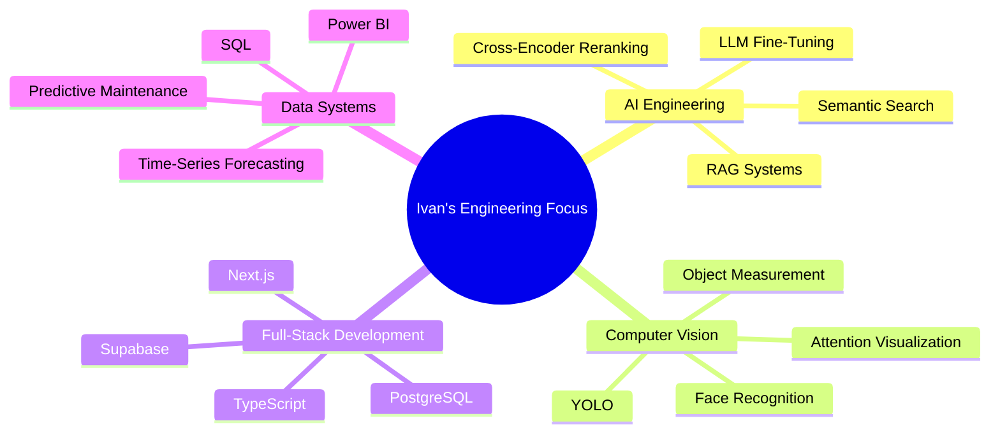
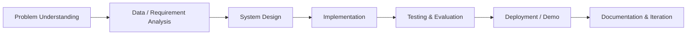

# Hi, I'm Thariq Ivan Anendar 👋

### AI/ML-Focused Software Engineer | Full-Stack Web Developer | Computer Vision & RAG Builder

I build practical software products that combine **AI/ML**, **full-stack engineering**, and **data-driven workflows** — from legal RAG chatbots and computer vision systems to learning platforms and analytics dashboards.

 

 

---

## 🚀 About Me

I'm an Informatics Engineering undergraduate at **Institut Teknologi Sepuluh Nopember** with a strong focus on building real-world software systems using AI, data, and web technologies.

My work usually sits at the intersection of:

- **AI/ML Engineering** — computer vision, NLP, RAG, LLM fine-tuning, forecasting
- **Full-Stack Development** — Next.js, React, TypeScript, Supabase, PostgreSQL
- **Data & Analytics** — SQL, Power BI, time-series analysis, predictive maintenance
- **Applied Systems** — UAV systems, embedded workflows, cloud-based image storage

I care about clean architecture, reliable data flow, readable interfaces, and pipeline that easy to maintain.

---

## 🧰 Tech Stack

### Languages

### AI / ML / Computer Vision

### LLM / RAG

### Web / Backend / Database

---

## 📌 Featured Projects

<b>⚖️ LawBot — Legal Chatbot with Fine-Tuned LLM and RAG</b>

 

A legal chatbot for Indonesian TNI law revision information using fine-tuned LLMs and Retrieval-Augmented Generation.

**What I built:**

- Legal document cleaning, chunking, tokenization, and embedding pipeline
- Vector storage with ChromaDB
- Hybrid retrieval using BM25, semantic search, cosine similarity, and cross-encoder reranking
- QLoRA-based LLM fine-tuning and evaluation using ROUGE, Semantic F1-Score, factual accuracy, completeness, and hallucination rate
- Streamlit prototype with document-grounded answers and supporting references

**Tech:** PyTorch, Transformers, QLoRA, LangChain, ChromaDB, Streamlit  
**Repository:** [Chatbot UU TNI](https://github.com/vannndar/chatbot-uu-tni)
**Demo / Case Study:** [Deployment](https://chatbot-uu-tni-pptmaeqszwp596eckyfbgv.streamlit.app/)

<b>🐦 Identifikasi Walet — CCTV-Based Bird Individual Identification</b>

 

An end-to-end computer vision pipeline for individual bird identification from CCTV images.

**What I built:**

- CCTV frame extraction and image labeling workflow
- YOLO-based detection experiments
- ResNet and InsightFace-based embedding pipeline
- Inference web app for embedding inspection and prediction analysis
- Evaluation pipeline with accuracy, EER, ROC AUC, PR AUC, and F1-score reporting

**Result:** Test accuracy 0.9933, EER 0.00256, ROC AUC 0.99997, PR AUC 0.99991, best test F1-score 0.99562  
**Tech:** YOLO, ResNet, InsightFace, Python, Computer Vision  
**Repository:** Private

<b>📚 LearningWithUs — Study Planner and Notes Platform</b>

 

A full-stack learning platform for managing courses, modules, weekly schedules, notes, focus sessions, and learning analytics.

**What I built:**

- Course, module, event, note, and focus-session data model
- Weekly planner and recurring schedule generation
- Rich notes editor
- Pomodoro logging, XP, level, badge, and streak tracking
- Notes architecture prepared for future LLM/RAG chatbot integration

**Tech:** TypeScript, Next.js, React, Tailwind CSS, Supabase, PostgreSQL  
**Repository:** [LearningWithUs](https://github.com/vannndar/learningwithus)'
**Deployment** [Live Website](https://learningwithus.vandar.id/)

<b>🧠 Multi-Attentional Deepfake Detection</b>

 

A binary deepfake detection system for classifying face images as real or fake using a Multi-Attention architecture with ConvNeXt backbone.

**What I built:**

- Local attention pooling and global feature extraction
- Texture enhancement and ensemble classification
- Streamlit inference demo with image upload
- Checkpoint loading from Google Drive
- Attention map visualization for model interpretation

**Result:** Evaluation accuracy 85.66%, FAKE class F1-score 0.9228, weighted F1-score around 0.7905  
**Tech:** Python, PyTorch, timm, Streamlit, ConvNeXt  
**Repository:** [Deepfake Detection](https://github.com/vannndar/deepfake-detection)

<b>📈 Generative-AI-Saham — Stock Price Forecasting with News Sentiment</b>

 

A stock forecasting web app combining historical stock price data with news sentiment signals.

**What I built:**

- Automated yfinance data pipeline
- Detik.com news scraping and sentiment mapping
- MinMaxScaler normalization and 60-timestep sequence windowing
- LSTM model with sentiment feature concatenation
- Dash and Plotly dashboard for experiment comparison

**Result:** BBNI forecasting RMSE 61.74 and R² Score 0.9733 using Siebert news sentiment  
**Tech:** LSTM, TensorFlow/Keras, Dash, Plotly, yfinance  
**Repository:** [Generative AI Stocks](https://github.com/vannndar/Generative-AI-Saham)

---

## 🧭 Current Engineering Focus

---

## 🧪 Engineering Workflow

---

## 📊 GitHub Overview

  
  

---

## 🏆 Selected Achievements

- Funding Recipient and Team Member — **Bayusuta, TEKNOFEST Turkey 2025**
- Funding Recipient — **Program Kreativitas Mahasiswa, Kemdikbudristek & Belmawa 2023**
- 3rd Place — **Kontes Robot Terbang Indonesia 2023 National Level**
- 1st Place — **Kontes Robot Terbang Indonesia 2024 Regional Level**
- Best Method Award — **Kontes Robot Terbang Indonesia 2024 National Level**

---

## 📜 Certifications

- Microsoft Azure for AI and Machine Learning — Microsoft
- Foundations of AI and Machine Learning — Microsoft
- Databases and SQL for Data Science with Python — IBM
- Deep Learning: Neural Network & AI — Udemy
- Natural Language Processing with Transformers in Python — Udemy

---

## 🤝 Let's Connect

I'm open to software engineering opportunities, AI/ML projects, full-stack collaborations, and technical discussions.

- GitHub: [github.com/vannndar](https://github.com/vannndar)
- LinkedIn: [linkedin.com/in/thariqivan](https://linkedin.com/in/thariqivan)
- Email: [thariq.ivan@gmail.com](mailto:thariq.ivan@gmail.com)

---

<b>Building useful systems, not just finished projects.</b>

