# Hi, I'm Thariq Ivan Anendar

### Software Engineer building AI, computer vision, and data-driven web products

I am an Informatics Engineering undergraduate at Institut Teknologi Sepuluh Nopember.  
My recent work focuses on legal document retrieval, computer vision, learning platforms, and time-series forecasting.

 

---

## About Me

I build software systems that combine artificial intelligence, data processing, and web technologies.

My projects have involved legal document retrieval, individual bird identification from CCTV footage, deepfake detection, stock-price forecasting, and full-stack learning applications.

I am particularly interested in:

- Retrieval-Augmented Generation and semantic search
- Computer vision and embedding-based recognition
- Full-stack application development
- Data pipelines and model evaluation
- Deploying machine-learning systems as usable products

I care about clean architecture, reliable data flow, readable interfaces, and pipelines that are easy to maintain.

---

## Selected Projects

### LawBot

A legal-information chatbot developed using Indonesian TNI legal documents, fine-tuned language models, and Retrieval-Augmented Generation.

My work included:

- Cleaning, chunking, tokenizing, and embedding legal documents
- Storing document embeddings in ChromaDB
- Combining BM25, semantic search, cosine similarity, and cross-encoder reranking
- Fine-tuning a language model using QLoRA
- Evaluating responses using ROUGE, Semantic F1-Score, factual accuracy, completeness, and hallucination rate
- Building a Streamlit interface with document-grounded responses and supporting references

**Stack:** PyTorch, Transformers, QLoRA, LangChain, ChromaDB, Streamlit

[Repository](https://github.com/vannndar/chatbot-uu-tni) · [Live Demo](https://chatbot-uu-tni-pptmaeqszwp596eckyfbgv.streamlit.app/)

---

### Identifikasi Walet

An individual bird-identification system developed from CCTV imagery using object detection and embedding-based recognition.

My work included:

- Extracting frames from CCTV recordings
- Preparing and labeling the image dataset
- Running YOLO-based detection experiments
- Building ResNet and InsightFace embedding pipelines
- Developing an inference interface for prediction and embedding inspection
- Evaluating the system using accuracy, EER, ROC AUC, PR AUC, and F1-score

**Selected results:**

- Test accuracy: 99.33%
- Equal Error Rate: 0.00256
- ROC AUC: 0.99997
- PR AUC: 0.99991
- Best test F1-score: 0.99562

**Stack:** Python, YOLO, ResNet, InsightFace, Computer Vision

**Repository:** Private

---

### LearningWithUs

A full-stack learning platform for managing courses, modules, study schedules, notes, focus sessions, and learning progress.

The application includes:

- Course and module management
- Weekly and recurring study schedules
- Rich-text notes
- Pomodoro session tracking
- XP, levels, badges, and learning streaks
- Learning analytics
- A notes architecture prepared for future RAG-based chatbot integration

**Stack:** TypeScript, Next.js, React, Tailwind CSS, Supabase, PostgreSQL

[Repository](https://github.com/vannndar/learningwithus) · [Live Website](https://learningwithus.vandar.id/)

---

## Other Projects

### Multi-Attentional Deepfake Detection

A binary image-classification system for identifying real and manipulated facial images using a Multi-Attention architecture with a ConvNeXt backbone.

The system includes local attention pooling, global feature extraction, texture enhancement, ensemble classification, and attention-map visualization.

**Selected results:**

- Evaluation accuracy: 85.66%
- FAKE-class F1-score: 0.9228
- Weighted F1-score: approximately 0.7905

**Stack:** Python, PyTorch, timm, ConvNeXt, Streamlit

[Repository](https://github.com/vannndar/deepfake-detection)

---

### Generative-AI-Saham

A stock-price forecasting application that combines historical stock data with sentiment extracted from online news.

The project includes:

- Automated financial data collection using yfinance
- News scraping from Detik.com
- News sentiment processing
- MinMaxScaler normalization
- A 60-timestep sequence-generation pipeline
- An LSTM forecasting model with sentiment features
- A Dash and Plotly dashboard for experiment comparison

**Selected result:**  
BBNI forecasting achieved an RMSE of 61.74 and an R² score of 0.9733 using Siebert-based news sentiment.

**Stack:** Python, TensorFlow, Keras, LSTM, Dash, Plotly, yfinance

[Repository](https://github.com/vannndar/Generative-AI-Saham)

---

## Core Technologies

### Languages

### AI and Machine Learning

### LLM and Retrieval

### Web and Database

---

## GitHub Activity

  
  

---

## Selected Achievements

- Funding Recipient and Team Member — **Bayusuta, TEKNOFEST Turkey 2025**
- Funding Recipient — **Program Kreativitas Mahasiswa, Kemdikbudristek and Belmawa 2023**
- Third Place — **Kontes Robot Terbang Indonesia 2023, National Level**
- First Place — **Kontes Robot Terbang Indonesia 2024, Regional Level**
- Best Method Award — **Kontes Robot Terbang Indonesia 2024, National Level**

---

## Certifications

- Microsoft Azure for AI and Machine Learning — Microsoft
- Foundations of AI and Machine Learning — Microsoft
- Databases and SQL for Data Science with Python — IBM
- Deep Learning: Neural Network and AI — Udemy
- Natural Language Processing with Transformers in Python — Udemy

---

## Contact

I am open to software engineering opportunities, AI and machine-learning projects, full-stack collaborations, and technical discussions.

- [GitHub](https://github.com/vannndar)
- [LinkedIn](https://linkedin.com/in/thariqivan)
- [Email](mailto:thariq.ivan@gmail.com)

---

**Building software that solves real problems.**

